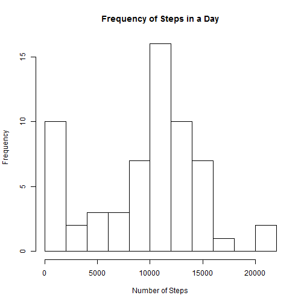
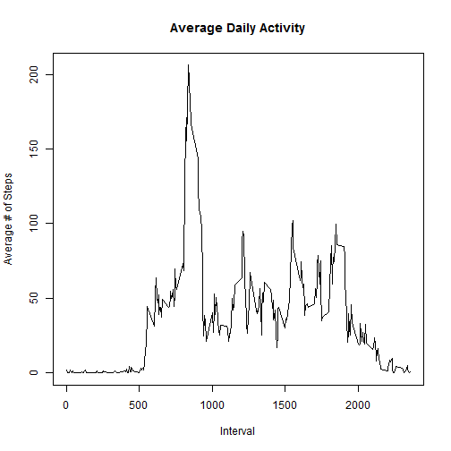
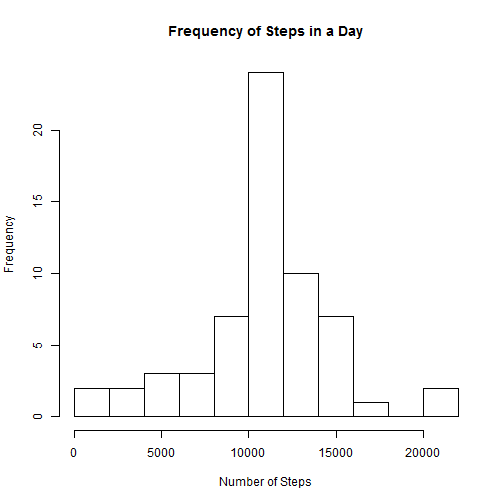
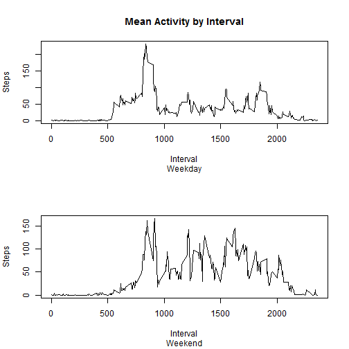

# Reproducible Research: Peer Assessment 1


## Loading and preprocessing the data

```r
act_data <- read.table(file = "activity.csv",header=T,sep=",",colClasses=c("integer","Date","integer"))
```


## What is mean total number of steps taken per day?


```r
steps_hist <- aggregate(act_data$steps,by=list(act_data$date),FUN=sum,na.rm=T)
hist(steps_hist[[2]],breaks=10,main="Frequency of Steps in a Day",xlab="Number of Steps")
```

 

The above shows the frequency of steps in a day broken into 10 distinct buckets.


```r
steps_mean <- mean(steps_hist[[2]])
steps_median <- median(steps_hist[[2]])
```

The mean number of steps taken each day was 9354.2295 and the median was 10395.

## What is the average daily activity pattern?


```r
interval_steps <- aggregate(act_data$steps,by=list(act_data$interval),FUN=mean,na.rm=T)
plot(interval_steps[[2]]~interval_steps[[1]],type="l",xlab="Interval",ylab="Average # of Steps",main="Average Daily Activity")
```

 

The above time series shows the average daily activity.  As expected low levels of activity are seen very late and early in the day when you would expect sleep to be occurring.  The peak level of activity appears to be around the 850 interval.


```r
names(interval_steps) <- c("Interval","Steps")
subset(interval_steps,Steps==max(interval_steps[[2]]))
```

```
##     Interval Steps
## 104      835 206.2
```

We can now see that on average the maximum amount of activity takes place in the 835 interval.

## Imputing missing values


```r
num_missing <- sum(is.na(act_data))
print(num_missing)
```

```
## [1] 2304
```

There are a total of 2304 missing values in the data set.

I have chosen to replace the missing values with thier interval means.  The code to accomplish this is as follows.


```r
act_data_complete <- act_data
for(i in 1:nrow(act_data_complete)){
        if(is.na(act_data_complete[i,1])){
                act_data_complete[i,1] <- subset(interval_steps,Interval == act_data_complete[i,3],Steps)
        }
}
```


```r
steps_hist_complete <- aggregate(act_data_complete$steps,by=list(act_data_complete$date),FUN=sum,na.rm=T)
hist(steps_hist_complete[[2]],breaks=10,main="Frequency of Steps in a Day",xlab="Number of Steps")
```

 

A newly revised histogram of steps in a day reveals far fewer days in the lowest bucket.


```r
steps_mean_complete <- round(mean(steps_hist_complete[[2]]),digits=0)
steps_median_complete <- round(median(steps_hist_complete[[2]]),digits=0)
```

Both the mean and the median have increased as a result of the missing value imputation.

The new mean is: 10766.19
The new median is: 10766.19


## Are there differences in activity patterns between weekdays and weekends?


```r
act_data_complete$TimeOfWeek <- weekdays(act_data_complete$date)
for(i in 1:nrow(act_data_complete)){
        if(act_data_complete[i,4] %in% c("Saturday","Sunday")){
                act_data_complete[i,4] <- 'weekend'
        }else{
                act_data_complete[i,4] <- 'weekday'
        }
}
act_data_complete$TimeOfWeek <- as.factor(act_data_complete$TimeOfWeek)
```


```r
week_agg <- aggregate(act_data_complete$steps,by=c(list(act_data_complete$interval),list(act_data_complete$TimeOfWeek)),FUN=mean,na.rm=T)
names(week_agg) <- c("interval","type","stepsMean")
weekday_means <- subset(week_agg,type=="weekday",select=stepsMean)
weekday_intervals <- subset(week_agg,type=="weekday",select=interval)
weekend_means <- subset(week_agg,type=="weekend",select=stepsMean)
weekend_intervals <- subset(week_agg,type=="weekend",select=interval)
par(mfrow=c(2,1))
plot(weekday_means[[1]] ~ weekday_intervals[[1]],type="l",
     main="Mean Activity by Interval",sub="Weekday",xlab="Interval",ylab="Steps")
plot(weekend_means[[1]] ~ weekend_intervals[[1]],type="l" 
     ,sub="Weekend",xlab="Interval",ylab="Steps")
```

 

There is a clear difference in activity between weekday and weekends.  Activity starts later in the day on weekends suggesting the subject is sleeping in on the weekend.

